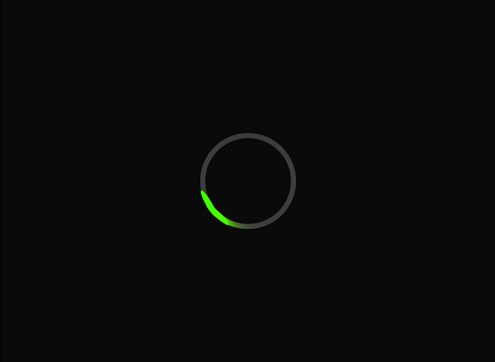

#Mini Exercise No. 3

Link to my throbber: https://pfisk.github.io/Mini-Exercises/miniEX3/index07

##About my design

I've decided to make my throbber a "smooth" animation (instead of making it look like the most commonly used dotted type). This was pretty straight forward and it was achieved through playing around with the framerate and the increments of rotation. Too make it smooth, i decided upon splitting the circle into 60 pieces and making the framerate 60 as well. This got me the look i wanted, but not the finish. I decided to make my basic circle into an ellipse, to make it look "faster". I added a circle behind the throbber as well to make it stand out more as an complete element. 

The basic look and idea was done at this point, but i wasn't satisfied. I wanted to challange myself a bit, and thought to myself "why not make it pulse as it goes around the circle?". I made the color pulse through a sinus function, but it didn't look as pleasing as i hoped for. New idea: make it a rainbow. This took some time to figure out, but I remebered a video with Daniel Shiffman, where he changed the colormode of the script as part of a coding challenge. I knew i could used this. I changed the colormode to "HSB" (Hue, Saturation, Brightness) and made a variable that would cycle through through the numbers 0 to 255 and then reset. Entering this variable in the hue value of the ellipse' fill, would create the rainbow effect i was going for. I tried it, and decided to add a second ellipse behind the existing one, to make the "tail" a bit longer. It worked out perfectly and i was finally satisfied.

All in all, the process has been mostly experimental and a bit frustrating at times, but in the end I got the result I was looking for without any compromise.

##How can we use programming to reflect and inquire digital culture?

The possibilities within programming is almost infinte and as a result of this, the use is as well. However "throbbers" are used for telling the user, that they have to wait. That something is loading. Too further extend, they are most commonly used as a cover for what is really going on. Its a layer that is put up in front off the user too look at while something is going on "behind the scenes". Think of it as a curtain covering up what is happening between acts at a theatre. Essentially, the throbber is not actually bound to the loading as a sign of loading. Its simply an animation circling around, designed to grab the users attention and to show that atleast _something_ is happening. The throbber is in some ways easier to "forgive" than a progress bar. As we don't get any signs of progress, we won't notice lack of progress (if that is the case). It makes time seem constant.
