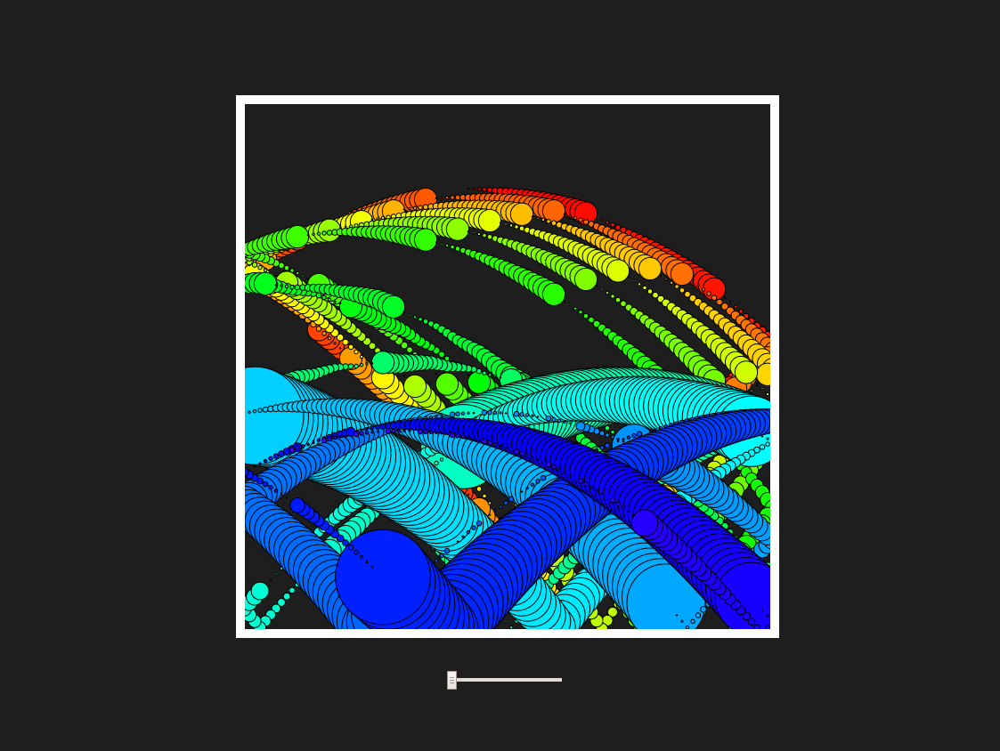

#Mini Exercise No. 4

##This work of art is dubbed: 
#Snabel Simulator

##About the work and how it demonstrates the notion of "feedback"?
This work is an abomination of an good idea, that refused to be executed the way i wanted it to. The initial concept was an idea by /duendue, which he kindly let me borrow. I never got to make it work a 100%, so instead i made this. The original idea included a bunch of different elements which are still present, however nowhere close to how they work in this final version.

The sketch contains black background and a white frame. Inside the frame a continuously drawn ball affected by gravity bounces around, creating a colorshifting rainbow trail behind it. It scales repeatedly to a given size and resets to being very small over and over again.
With this you can make your own custom artwork.

It demonstrates the notion of "feedback" in a couple of different ways. The scaling of the balls are controlled by the feedback from the users interaction with a slider underneath the frame. You can also interact with the work with your keyboard, by using the arrow keys up and down to control the speed of the balls. If you are unsatisfied with your drawing, you can wipe the frame clean by pressing "C". When you are satisfied though, you can press "F" to freeze the sketch. You can now enjoy your beautiful creation to eternity.

Link: https://pfisk.github.io/Mini-Exercises/miniEX4/Snabel_Simulator
