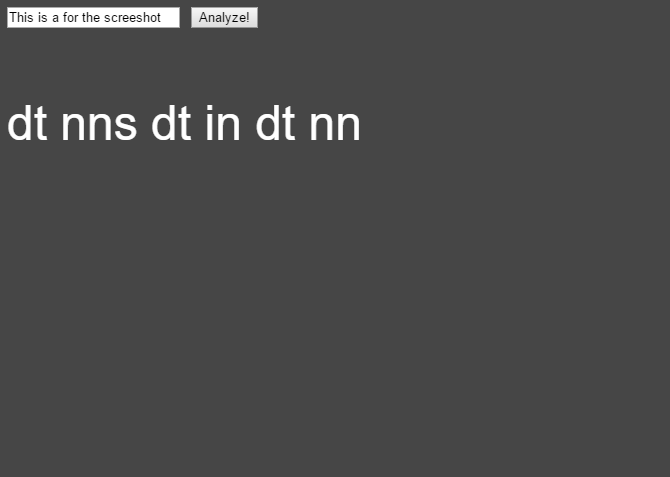

#Super simple word analyzer

##What it is and functions used
This final version of what my miniexercise is, is basically a very simple word analyzer tool. You can input your own text, and have it analyzed and displayed on the canvas. The analyzing tool, will output RiTa's default "POS - Part of Speech" (PENN) tags.

##My process
For this project i've tried to use a range of different functions from the RiTa library, however, i've encountered a bunch of errors which have caused a major delay in my programming process.
So far my experience working with found text and extern source materials have been really frustrating due to all the errors i have encountered. My initial idea of what a wanted to create was sadly not possible, either due to computer syntax and file problems or my own incompetance. This is the miniexercise i've spent the most time on, compared to how shallow my final result is. I wasn't able to load any external files, whether it was fonts, textfiles or whatever. I've tried numerous different approaches and workarounds, but with no luck. I consider myself semi tech savvy, however my system seemed to be in a wild state of utter lockdown and uncooperability. 

My initial idea was to create a interactive sketch, that would take a simple string and make it complicated but still understandable over time or interactivety with it. However, things went south and nothing worked. It was on to plan B. This idea, was to create a interactivy sketch, where you would be able to write or import your own text, and then, using a few of RiTa's functions, censor all of the cursewords out. This wasn't possible either, due to numerous errors. Plan C was initiated, and that is what my final sketch is. Simple and boring, but at least it works. However, it uses no preloaded files, though it does use a simple RiTa funnction ("getPosTags") used to tag the input words.

##Materiality in text/interface
I think the notion of materiality in these types of programs and works of art is pretty exciting. I like how you can do different interactions with the text and get unlimited amount of different outputs, depending on how the particular program/artwork is setup. Its a powerful tool, that can be used effectively in numerous ways.

Link: 
