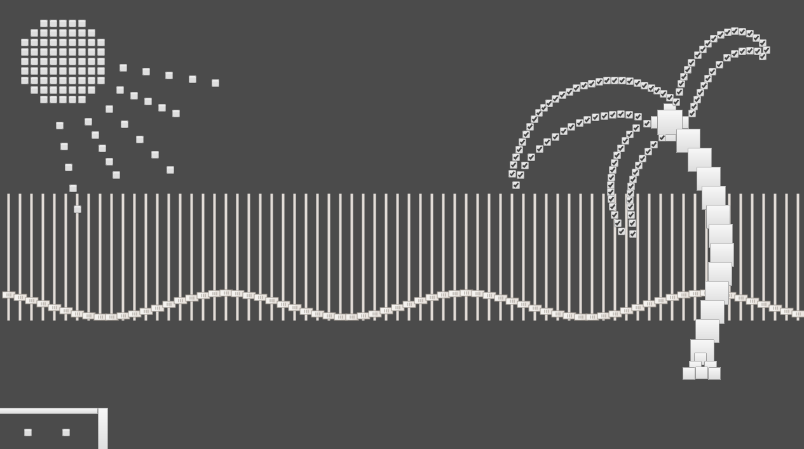

# Beach

The artwork is supposed to look like a tropical beach with sunshine and a palm tree. 

## My experience using objects 

Using objects and creating form art, has been a rollercoaster ride for me. I've had a lot of different ideas, that i have been forced to scrap halfway through, due to errors (either by me or by the implementation of HTML objects). I ended up with executing one of my ideas at last, which im satisfied with aesthetically. What im not satisfied with is the code, and how "bad" the final version is. I had some trouble getting arrays of HTML objects to respond to certain command and as a result i ended up hardcoding way more stuff than planned (look at the code if you dare - its not pretty). I really like the idea of using HTML elements to create form art though, and i would like to revisit the idea in the future.

## Pros and cons using objects

What i find really neat about using objects in code, is how you in a relatively simple manner, can create quite complex interactions. Conventional objects are great for at whole deal of different reasons. "Playing" with objects in coding is a good way of learning different syntax and coding rules. Objects can help the user understand, as they can be used to visualize things. 
Using HTML objects for aesthetic purposes is a really cool idea as well, but can be a bit tricky and or tedious process depending of what you decide to create. The manipulation of HTML objects seems very forced compared to regular p5.js elements. There is a lot of limits on the customization of HTML objects, which isn't optimal when creating aesthetic programs

##

Link: https://pfisk.github.io/Mini-Exercises/miniEX7/miniEX7
