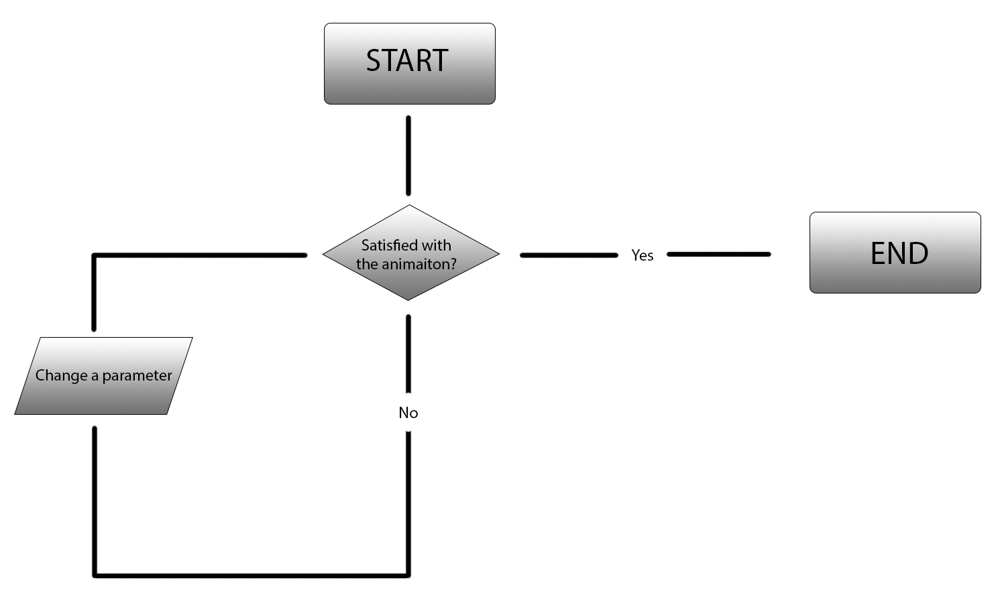

# Cirqualizer

## Selected Coding Challenge

I based this project on two different tutorials by Daniel Shiffman.

FFT Analysis: https://youtu.be/2O3nm0Nvbi4

Blobby:       https://youtu.be/rX5p-QRP6R4

## Syntax and functions added

For the coding challenge this sketch is based on, I have added a bunch of different features. The most important feature is the sound analysis, which is based on Daniel Shiffmans video on FFT (Fast Fourier Transform) analysis. FFT is an algorithm used for analysing soundwaves. In this sketch, that is used to make the "blobby" be interactive upon the sound played. I have changed a lot of different values and added some features to make sure I got the look I was going for. The core of the program is essentially the same, however the code looks quite different from the original. In addition, a have added some HTML elements from the DOM library to make the sketch a bit more interactive.

Features added: Sliders, buttons, colorMode changes, fading effect, sound and interactivity through FFT analysis.

## The difficulty of working with someone else's code

It can be a challenge to work with code that aren't your own. Depending on who wrote the original code, it can sometimes be very tricky to understand exactly what controls what. If the original writer writes comments on the code, each part can be understood with relative ease, however, different functions that you don't know of can be used, and that can be a challenge to work with. Essentially you won't be able to use the code to its full potential if you don't know exactly what does what and how. If the original code is without any comments in any way, it can be a difficult task to use it probably, of course dependant on your programming skill.

As Daniel Shiffman is very good at explaining in his tutorials and coding challenges, I didn't find it hard to work with. I had to get used to some of the syntax used in the newly added functions, but by playing around with the code, I figured out pretty quickly.

## Using flowcharts to communicate and organize

Flowcharts can be a valuable tool, when stitching together larger scale programs. They can be used in a way of organizing and making clear exactly what the program does, why and how. The purpose of them is to simplify what is happening in the given program (or whatever they are created for), both for the programmer or creator himself and for everyone else. They can make reflection upon the given object very easy, no matter each individual skill of the participants.

Creating a flowchart for this program wasn't really of too much use, as the program is very simple. However, it got me thinking about possible interaction and uses in another way as I did before creating it. In some way, it got me to ask myself: "Who is going to use this program, how and why?".

Link: https://pfisk.github.io/Mini-Exercises/miniEX8/index
